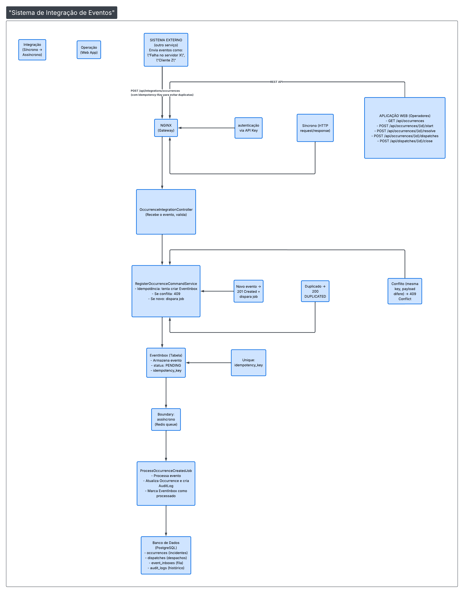
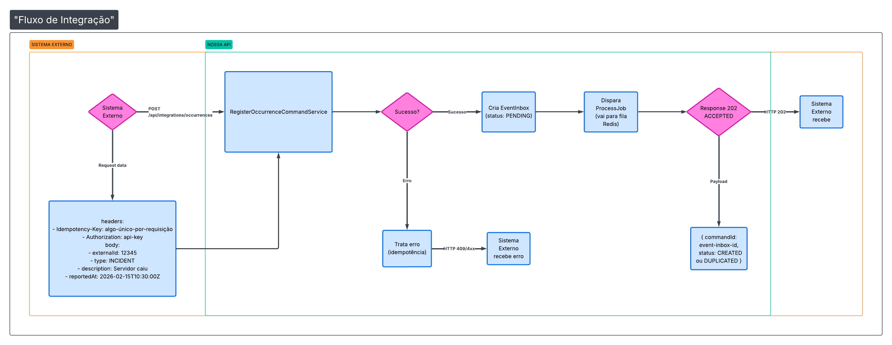

# Minha Resolução: 🧪 Desafio Técnico — Sistema de Gestão de Ocorrências do Corpo de Bombeiros

Olá, essa é a minha resolução back-end para a prova. A **API** foi  construído em **Laravel** assim como solicitado, ela recebe eventos de um sistema externo, consolida ocorrências (tipo tickets de incidentes), controla todo o ciclo de vida desses eventos, registra auditoria e processa tudo de forma assíncrona.

---

## 📋 Início

1. [Como rodar backend e frontend](#como-rodar-backend-e-frontend)
2. [Desenho de Arquitetura](#desenho-de-arquitetura)
3. [Estratégia de Integração Externa](#estratégia-de-integração-externa)
4. [Estratégia de Idempotência](#estratégia-de-idempotência)
5. [Estratégia de Concorrência](#estratégia-de-concorrência)
6. [Pontos de Falha e Recuperação](#pontos-de-falha-e-recuperação)
7. [O que Ficou de Fora](#o-que-ficou-de-fora)
8. [Como Evoluir na Corporação](#como-evoluir-na-corporação)

---

## Como Rodar Backend e Frontend

### Opção 1: Docker (Recomendado) 🐳

Esta é a forma mais simples e consistente. Docker garante que o ambiente seja exatamente igual para todo mundo.

```bash
# 1. Clone o repositório (se não tiver ainda)
git clone <seu-repo> prova-api
cd prova-api

# 2. Suba os containers (vai baixar imagens, montar tudo)
docker compose up -d --build

# 3. Na primeira vez, execute o bootstrap
docker compose exec app sh -lc "\
  [ -f .env ] || cp .env.example .env; \
  php artisan key:generate; \
  php artisan migrate --force
"
```

Pronto! Acesse em seu navegador:
- **API**: `http://localhost:8000`
- **API com porta customizada**: `export APP_PORT=8010 && docker compose up -d` (depois acessa em `http://localhost:8010`)

#### Entender o que acontece

- O Dockerfile usa **PHP 8.4** (porque as dependências do projeto exigem isso)
- O `entrypoint.sh` cuida de rodar `composer install` e `npm ci` automaticamente na primeira vez
- O Redis é usado para fila de jobs
- PostgreSQL armazena os dados

#### Ver logs

```bash
# Ver os últimos 200 linhas de log
docker compose logs --tail=200 --no-color

# Acompanhar logs em tempo real
docker compose logs -f app

# Ver logs de um serviço específico (redis, postgres, nginx)
docker compose logs -f redis
```

#### Parar e limpar

```bash
# Parar containers mas manter volumes (dados)
docker compose stop

# Parar e remover tudo (cuidado! vai perder dados no banco se não fez backup)
docker compose down

# Remover tudo + volumes
docker compose down -v
```

---

### Opção 2: Rodar Localmente (Sem Docker **[Mais Difícil]** )

Se preferir rodar direto na sua máquina:

#### Pré-requisitos

- **PHP 8.4+** (verificar com `php -v`)
- **Composer** (verificar com `composer --version`)
- **Node.js 18+** (verificar com `node -v`)
- **PostgreSQL 15+**
- **Redis**

#### Setup

```bash
# 1. Instale dependências PHP
composer install

# 2. Copie o arquivo de configuração
cp .env.example .env

# 3. Gere a chave da aplicação
php artisan key:generate

# 4. Configure o banco de dados no .env
# DB_HOST=127.0.0.1
# DB_DATABASE=prova_api
# DB_USERNAME=seu_usuario
# DB_PASSWORD=sua_senha

# 5. Execute as migrações
php artisan migrate --force

# 6. Instale dependências JavaScript
npm install

# 7. Rode em modo desenvolvimento
composer run dev
```

O comando `dev` vai rodar:
- Servidor PHP em `http://localhost:8000`
- Fila de jobs processando em tempo real
- Logs em tempo real
- Vite compilando CSS/JS ao vivo

Para parar, aperte `Ctrl+C`.

---

## Desenho de Arquitetura

Aqui está o diagrama simples (não tenho muita experiência nisso) da arquitetura do sistema:



> **Nota**: A imagem acima mostra o fluxo completo de dados, desde o sistema externo até o banco de dados, passando por controllers, services e jobs.

### Os 4 Pilares da Arquitetura

#### 1️⃣ **Controllers** (Entrada de Dados)
Localização: `app/Http/Controllers/`

- `OccurrenceIntegrationController`: recebe eventos do sistema externo
- `OccurrenceController`: operações da API interna (listar, iniciar, resolver)
- `OccurrenceDispatchController`: criar e fechar despachos

**O que faz**: valida requisição, chama service, retorna resposta.

#### 2️⃣ **Services** (Lógica de Negócio)
Localização: `app/Services/Api/`

- `RegisterOccurrenceCommandService`: recebe ocorrência externa
- `OccurrenceService`: gerencia ciclo de vida (start, resolve)
- `ProcessOccurrenceCreatedService`: processa evento assincronamente
- `DispatchService`: cria e fecha despachos com idempotência

**O que faz**: coloca dados no banco, trata erros, dispara jobs.

#### 3️⃣ **Models** (Camada de Dados)
Localização: `app/Models/`

- `Occurrence`: um incidente/problema
- `Dispatche`: um despacho (pessoa/recurso alocado)
- `EventInbox`: fila de eventos a processar
- `AuditLog`: registro de tudo que aconteceu
- `User`: usuário do sistema

**O que faz**: define tabelas, relacionamentos, castings.

#### 4️⃣ **Jobs** (Processamento Assíncrono)
Localização: `app/Jobs/`

- `ProcessOccurrenceCreatedJob`: processa criação de ocorrência
- `ProcessOccurrenceStartJob`: processa início de ocorrência
- `ProcessOccurrenceResolveJob`: processa resolução de ocorrência
- `ProcessDispatchCreatedJob`: processa criação de despacho
- `ProcessDispatchClosedJob`: processa fechamento de despacho

**O que faz**: fica na fila Redis, executa depois, tenta 3 vezes se falhar (com backoff de 10s, 30s, 90s).

---

## Estratégia de Integração Externa

Como o sistema externo se comunica com a gente? Aqui está o fluxo detalhado:

### Fluxo de Integração



### Como o Sistema Externo Envia Dados

1. **Autenticação**: enviar header `Authorization: <sua-api-key>`
2. **Idempotência**: sempre enviar `Idempotency-Key` (como um ID único para essa requisição)
3. **Payload obrigatório**:
   ```json
   {
     "externalId": "ID único no sistema dele",
     "type": "INCIDENT|ALERT|...",
     "description": "O que aconteceu",
     "reportedAt": "2026-02-15T10:30:00Z"
   }
   ```

### Possíveis Respostas

| Status | Significado | Body |
|--------|-------------|------|
| **202 Accepted** | Evento aceito, vai ser processado | `{ commandId, status: 'CREATED' }` |
| **202 Accepted** | Já vimos esse evento antes | `{ commandId, status: 'DUPLICATED' }` |
| **409 Conflict** | Mesmo Idempotency-Key mas payload diferente | Erro de idempotência |
| **400 Bad Request** | Dados inválidos | Erro de validação |
| **401 Unauthorized** | Chave de API inválida ou ausente | Erro de autenticação |

### Por que 202 Accepted?

Porque a requisição foi aceita mas **não foi processada ainda**. O processamento real acontece depois, na fila. É assíncrono! Isso significa:
- Você não bloqueia esperando processamento
- Se houver erro no processamento, você pode reenviar (idempotência)
- O sistema é mais rápido e responsivo

---

## Estratégia de Idempotência

Idempotência é tipo um escudo contra duplicatas. Imagina que a rede está ruim e a requisição é mandada duas vezes. Como sabemos que é a mesma? Com o `Idempotency-Key`!

### Como Funciona

```
1ª Requisição:
POST /api/integrations/occurrences
Idempotency-Key: "meu-evento-001"
Payload: { externalId: "123", type: "INCIDENT", ... }

✓ Aceita, cria EventInbox, guarda no banco

2ª Requisição (mesma chave, mesmo payload):
POST /api/integrations/occurrences
Idempotency-Key: "meu-evento-001"
Payload: { externalId: "123", type: "INCIDENT", ... }

✓ Vê que já existe, retorna o mesmo resultado (DUPLICATED)
  Não cria novo EventInbox
```

### Proteção Contra Conflito

```
1ª Requisição:
POST /api/integrations/occurrences
Idempotency-Key: "meu-evento-001"
Payload: { description: "Servidor caiu" }

✓ Aceita

2ª Requisição (MESMA CHAVE, PAYLOAD DIFERENTE):
POST /api/integrations/occurrences
Idempotency-Key: "meu-evento-001"
Payload: { description: "Servidor reiniciou" }

❌ CONFLITO! Retorna HTTP 409
   Erro: "O payload enviado diverge do registro existente"
```

### Implementação Técnica

Na tabela `event_inboxes`, existe um índice unique:

```sql
UNIQUE ('idempotency_key', 'type', 'source')
```

Isso garante que:
- Mesma chave + mesmo tipo + mesma origem = pode acontecer 1 vez só
- Se tentar inserir novamente, o banco rejeita (QueryException)
- Pegamos a exceção, verificamos o registro existente e retornamos o resultado

Código:
```php
try {
    EventInbox::create([
        'idempotency_key' => $idempotencyKey,
        'type' => $type->value,
        'source' => $source->value,
        // ... outros campos
    ]);
    return new IntegrationResult($eventInbox->id, OccurrenceIntegrationStatus::CREATED);
} catch (QueryException $exception) {
    // Identifica se é violação de unique
    if (DatabaseErrorHelper::isUniqueViolation($exception)) {
        $existing = EventInbox::where('idempotency_key', $idempotencyKey)->first();
        
        // Se o payload é igual, retorna DUPLICATED
        if ($existing->payload === $payload) {
            return IntegrationResult::DUPLICATED;
        }
        
        // Se é diferente, erro!
        throw new IdempotencyConflictException(...);
    }
}
```

### Resumo da Idempotência

| Situação | O que Acontece |
|----------|----------------|
| 1ª requisição com chave X | Cria e processa |
| 2ª requisição com chave X (mesmo payload) | Retorna DUPLICATED (não processa de novo) |
| 2ª requisição com chave X (payload diferente) | Erro 409 CONFLICT |
| 1ª requisição com chave Y | Cria e processa |

---

## Estratégia de Concorrência

Concorrência é quando múltiplas requisições/operações acontecem ao mesmo tempo. O desafio é: como evitar que uma mesma ocorrência seja processada 2x simultaneamente? Ou que dois operadores tentem fechar o mesmo despacho ao mesmo tempo?

### Problema de Concorrência (Race Condition)

```
Tempo │ Operador A                    │ Operador B
   0  │ GET /occurrences/123          │
   1  │ status = "PENDING"            │ GET /occurrences/123
   2  │                               │ status = "PENDING"
   3  │ POST /start                   │
   4  │ (atualiza DB)                 │ POST /start
   5  │ status = "STARTED"            │ (atualiza DB)
   6  │                               │ status = "STARTED" (de novo!)
      │
   Resultado: Mesma operação executada 2x!
```

### Solução 1: Lock Pessimista (Pessimistic Lock)

É tipo um "coloque a mão em cima" antes de fazer qualquer coisa:

```php
DB::transaction(function () {
    $event = EventInbox::where('id', $eventInboxId)
        ->lockForUpdate()  // Bloqueia para leitura/escrita
        ->first();
    
    // Ninguém mais consegue pegar esse registro até aqui
    
    if ($event->status !== EventInboxStatus::PENDING->value) {
        return; // Já foi processado, pula fora
    }
    
    // Processa...
    $event->update(['status' => EventInboxStatus::PROCESSED->value]);
});
```

**Vantagem**: garante que não há race condition
**Desvantagem**: bloqueia outras requisições (mais lento)

Usamos isso em `ProcessOccurrenceCreatedService`.

### Solução 2: Estado Imutável (Status)

A ocorrência tem um `status` que define seu estado:

```php
public enum OccurrenceStatus: string {
    case PENDING = 'pending';      // Recém criada, ainda não começou
    case STARTED = 'started';      // Alguém iniciou
    case RESOLVED = 'resolved';    // Encerrada
}
```

Antes de fazer qualquer operação, verificamos o status:

```php
public function resolveOccurrence($id) {
    $occurrence = Occurrence::findOrFail($id);
    
    // Só pode resolver se estiver STARTED
    if ($occurrence->status !== OccurrenceStatus::STARTED->value) {
        throw new LogicException('Só pode resolver uma ocorrência que foi iniciada');
    }
    
    // ... continua
}
```

Isso previne operações inválidas (tipo resolver algo que não foi iniciado).

### Solução 3: Fila de Processamento

O Redis gerencia a fila de forma sequencial:

```
Job 1: ProcessOccurrenceCreatedJob (evento 001)
Job 2: ProcessOccurrenceCreatedJob (evento 002)
Job 3: ProcessOccurrenceStartJob (evento 001)

Execução:
Job 1 executa → completa
Job 2 executa → completa
Job 3 executa → completa

Garantia: um job por vez, na ordem
```

Isso evita conflitos entre jobs que processam a mesma ocorrência.

### Resumo da Concorrência

| Estratégia | Quando Usada | Proteção |
|-----------|--------------|----------|
| **Lock Pessimista** | Processamento de jobs | Bloqueia registro enquanto processa |
| **Status/Estado** | Validações antes de operação | Verifica se pode fazer aquela operação |
| **Fila Sequencial** | Processamento de eventos | Um job por vez |
| **Idempotência** | Requisições duplicadas | Mesma chave = mesmo resultado |

---

## Pontos de Falha e Recuperação

Vou listar os principais pontos onde algo pode quebrar e como recuperamos:

### Ponto 1: Falha ao Criar EventInbox

**O que pode acontecer**: Erro de banco de dados ao inserir o evento.

**Como recuperamos**:
```php
try {
    EventInbox::create([...]);  // Tenta criar
} catch (QueryException $e) {
    if (DatabaseErrorHelper::isUniqueViolation($e)) {
        // É duplicata, tudo bem
        return IntegrationResult::DUPLICATED;
    }
    
    throw $e;  // Erro desconhecido, propaga
}
```

**Resposta ao cliente**: HTTP 500 ou 409 (conflito), dependendo do erro.

---

### Ponto 2: Job Falha ao Processar Evento

**O que pode acontecer**: Erro durante `ProcessOccurrenceCreatedJob` (ex: banco não responde).

**Como recuperamos**:

O job tenta **3 vezes** (veja `ProcessOccurrenceCreatedJob`):

```php
public int $tries = 3;

public function backoff(): array {
    return [10, 30, 90];  // Tenta em: 10s, 30s, 90s depois
}
```

**Fluxo**:
```
Tentativa 1: ERRO ❌ → aguarda 10s
Tentativa 2: ERRO ❌ → aguarda 30s
Tentativa 3: ERRO ❌ → move para tabela de falhas

EventInbox fica com:
- status = 'FAILED'
- error = 'mensagem do erro'
- processed_at = null
```

**Manual**: Um operador precisa investigar e tentar novamente manualmente.

---

### Ponto 3: Falha de Banco de Dados

**O que pode acontecer**: PostgreSQL cai, não consegue conectar.

**Como recuperamos**:

Dentro de um `DB::transaction()`:

```php
DB::transaction(function () {
    // Tudo aqui é rollback automaticamente se houver erro
    EventInbox::create([...]);
    Occurrence::create([...]);
    AuditLog::create([...]);
});
```

Se qualquer coisa falhar, tudo volta atrás (nada fica meio-caminho).

---

### Ponto 4: Fila Redis Cai

**O que pode acontecer**: Redis não está disponível, jobs não conseguem ser enfileirados.

**Como recuperamos**:

Quando você dispara um job:

```php
ProcessOccurrenceCreatedJob::dispatch($eventInbox->id);
```

Se Redis estiver offline, Laravel tenta guardar em banco de dados (depends do config, mas por padrão usa tabela `jobs`).

**Verificar**:
```bash
# Ver jobs pendentes
docker compose exec app php artisan queue:work --queue=default

# Tentar reprocessar jobs falhados
docker compose exec app php artisan queue:retry all
```

---

### Ponto 5: Timeout na Requisição Externa

**O que pode acontecer**: Sistema externo envia requisição mas desconecta antes de receber resposta.

**Como recuperamos**:

Usamos HTTP 202 (Accepted):

```php
return response()->json([...], 202);  // 202 = "recebi, vou processar depois"
```

Sistema externo entende que pode tentar de novo se não receber 202 em tempo útil.

**Idempotência garante**: Se tentar de novo com mesma chave, não cria duplicata.

---

### Ponto 6: Operador Tenta Fechar Despacho 2x Simultaneamente

**O que pode acontecer**: 2 cliques rápidos no botão "Fechar Despacho".

**Como recuperamos**:

1. **Idempotência**: ambas as requisições têm `Idempotency-Key` única?
   - Se SIM: 1ª sucesso (201), 2ª retorna DUPLICATED (202)
   - Se NÃO: depende do status do despacho

2. **Status do Despacho**: Se já está CLOSED, a 2ª tentativa será rejeitada
   ```php
   if ($dispatch->status === DispatchStatus::CLOSED) {
       throw new LogicException('Despacho já foi fechado');
   }
   ```

---

### Resumo dos Pontos de Falha

| Ponto | Falha | Recuperação |
|-------|-------|-------------|
| EventInbox | Erro BD | Retorna erro 500 ou 409 |
| Job | Falha processamento | Tenta 3x com backoff (10s, 30s, 90s) |
| Banco | Desligou | Transação faz rollback automático |
| Redis | Offline | Fallback para tabela `jobs` |
| Requisição | Timeout | Cliente tenta de novo (idempotência cuida) |
| Despacho | Fechar 2x | Idempotência + status evita |

---

## O que Ficou de Fora

Nenhum projeto é completo na primeira versão. Aqui estão coisas que não foram implementadas mas deveriam estar no roadmap:

### 1. **Autenticação Refinada**

❌ **Não tem**:
- Logout/Logout automático
- Refresh token
- Permissões por papel (ADMIN, OPERATOR, VIEWER)

✅ **Tem**:
- Middleware de autenticação por API Key

**Por que**: Modelo simplificado. Servidor é interno.

**Como adicionar**:
```php
// Criar tabela de roles
// Adicionar permissões no middleware
// Implementar política de acesso (can/auth checks)
```

---

### 2. **Notificações**

❌ **Não tem**:
- Email quando ocorrência é criada
- SMS para operador responsável
- Webhook para notificar sistema externo de atualização

✅ **Tem**:
- Sistema de auditoria (AuditLog)

**Por que**: Foco em core (receber, processar, armazenar).

**Como adicionar**:
```bash
# Criar jobs de notificação
php artisan make:job SendOccurrenceNotification

# Configurar provedores (Email, SMS, Webhook)
# No .env: MAIL_DRIVER, TWILIO_KEY, etc
```

---

### 3. **Relatórios e Analytics**

❌ **Não tem**:
- Dashboard com gráficos
- Tempo médio de resolução
- Taxa de sucesso/falha
- Exportar dados para BI

✅ **Tem**:
- Listagem de ocorrências
- AuditLog completo

**Por que**: Dados estão lá, só falta visualização.

**Como adicionar**:
```php
// Criar queries de agregação
$occurrencesByType = Occurrence::groupBy('type')
    ->selectRaw('type, COUNT(*) as total')
    ->get();

// Expor via endpoint
// Conectar com ferramenta BI (Metabase, PowerBI, Grafana)
```

---

### 4. **Cache Distribuído**

❌ **Não tem**:
- Cache de listagem em todos os clientes
- Invalidação de cache entre servidores

✅ **Tem**:
- Cache local por 30s na listagem (Redis)

**Por que**: Simplificado para 1 servidor.

**Como adicionar**:
```php
// Cache por chave complexa
Cache::remember("occurrence:{$id}:details", 60, function() {
    return Occurrence::with('dispatches')->find($id);
});

// Usar Redis Tags para invalidar relacionados
Cache::tags(['occurrence', $id])->flush();
```

---

### 5. **Rate Limiting**

❌ **Não tem**:
- Limite de requisições por API Key
- Proteção contra brute force

✅ **Tem**:
- Autenticação básica

**Por que**: Fase 1 sem proteção.

**Como adicionar**:
```php
// Middleware de rate limit
Route::middleware(RateLimiter::class)->group(function () {
    Route::post('/integrations/occurrences', ...);
});

// No .env: RATE_LIMIT=60,1 (60 requisições por minuto)
```

---

### 6. **Busca Avançada**

❌ **Não tem**:
- Filtro por data (between)
- Filtro por operador responsável
- Busca full-text

✅ **Tem**:
- Filtro básico por status/tipo (OccurrenceFilterDTO)

**Por que**: Básico para MVP.

**Como adicionar**:
```php
// Query builder com scopes
public function scopeFilterByDateRange($query, $start, $end) {
    return $query->whereBetween('reported_at', [$start, $end]);
}

// Usar em listagem
Occurrence::filterByDateRange($start, $end)->get();
```

---

### 7. **Escalabilidade Vertical**

❌ **Não tem**:
- Múltiplas workers (processadores de fila)
- Load balancer
- Replicação de banco de dados

✅ **Tem**:
- 1 worker, 1 banco, 1 servidor

**Por que**: Premissa é volume pequeno.

**Como evoluir**:
```bash
# Rodar múltiplos workers
docker compose up -d --scale app=3

# Adicionar load balancer (nginx, haproxy)
# Adicionar pool de conexões (pgBouncer)
# Replicação read-only do banco
```

---

### 8. **Tratamento de Erros Customizado**

❌ **Não tem**:
- Página de erro 404 customizada
- Página de erro 500 com ID de rastreamento
- Logging estruturado (ELK Stack)

✅ **Tem**:
- Tratamento básico de erros

**Por que**: Laravel cuida do básico.

**Como adicionar**:
```php
// Customizar ExceptionHandler
public function render($request, Throwable $exception) {
    if ($exception instanceof ModelNotFoundException) {
        return response()->json(['error' => 'Não encontrado'], 404);
    }
    
    return parent::render($request, $exception);
}
```

---

### 9. **Soft Deletes**

❌ **Não tem**:
- Recuperar ocorrências deletadas
- Audit trail de exclusão

✅ **Tem**:
- AuditLog toma conta disso (tudo fica registrado)

**Por que**: Auditar é suficiente.

**Como adicionar** (se quiser):
```php
// Adicionar SoftDeletes ao modelo
use SoftDeletes;

// Depois: Occurrence::onlyTrashed()->restore();
```

---

## Como Evoluir na Corporação

Você está aprendendo! Aqui estão dicas de como crescer tanto tecnicamente quanto profissionalmente com esse projeto:

### 1. **Entender o Negócio Primeiro**

Não é só código. Pergunte:

- ❓ Qual é o objetivo real desse sistema?
- ❓ Quem usa? (operadores, sistemas externos, gerentes)
- ❓ O que é sucesso? (tempo de resposta, acurácia, disponibilidade)
- ❓ Quando vai quebrar? (sob qual volume?)

**Ação**: Converse com PM ou product owner. Peça para acompanhar um operador por 1 dia.

---

### 2. **Aprofundar em Padrões de Design**

Este projeto usa vários:

- **Command Pattern**: `RegisterOccurrenceCommandService` (recebe comando, retorna resultado)
- **Service Layer**: lógica de negócio separada de controllers
- **DTO (Data Transfer Object)**: `OccurrenceDTO` (transporta dados entre camadas)
- **Event Sourcing**: `EventInbox` (tudo é um evento que pode ser reprocessado)
- **Idempotency Pattern**: garante mesmo resultado para mesma entrada

**Ação**: Pesquise cada um desses padrões. Estude o código. Implemente em novos recursos.

---

### 3. **Testes Automatizados**

Diretor quer garantia? Testes! 

Atualmente há testes básicos em `tests/Feature/IntegrationOccurrenceTest.php`.

**Ampliar cobertura**:

```bash
# Verificar cobertura atual
php artisan test --coverage

# Escrever testes
composer run test
```

**O que testar**:
- ✅ Feliz caminho (tudo dá certo)
- ✅ Caminhos tristes (validações, erros)
- ✅ Idempotência ( 2ª requisição com mesma chave)
- ✅ Concorrência (2 requisições simultâneas)

**Benefício**: confiança para refatorar, evita regressões.

---

### 4. **Performance**

Direto perguntam: "está lento?" ou "consegue 1 milhão de requisições/dia?"

**Pontos de melhoria**:

1. **Índices no Banco**:
   ```sql
   CREATE INDEX idx_occurrences_status ON occurrences(status);
   CREATE INDEX idx_event_inboxes_idempotency ON event_inboxes(idempotency_key);
   ```

2. **N+1 Query Problem**:
   ```php
   // ❌ Ruim (N queries)
   $occurrences = Occurrence::all();
   foreach ($occurrences as $occ) {
       echo $occ->dispatches()->count();  // Query extra!
   }
   
   // ✅ Bom (1 query com eager load)
   $occurrences = Occurrence::with('dispatches')->get();
   foreach ($occurrences as $occ) {
       echo count($occ->dispatches);  // Sem query extra
   }
   ```

3. **Caching**:
   ```php
   Cache::remember('top_occurrences', 3600, function () {
       return Occurrence::orderBy('created_at', 'desc')->limit(10)->get();
   });
   ```

**Ação**: Rode `composer run dev` com query logging ligado. Veja quais queries são lentas. Otimize.

---

### 5. **Documentação**

Código sem documentação é técnica dívida.

**Escrever**:

```php
/**
 * Registra uma ocorrência vinda de um sistema externo
 * 
 * @param OccurrenceDTO $occurrenceDTO Dados da ocorrência
 * @param string $idempotencyKey Chave única para evitar duplicatas
 * 
 * @return IntegrationResult Contém ID do evento e status
 * 
 * @throws IdempotencyConflictException Se mesma chave com payload diferente
 * @throws QueryException Se erro não relacionado a uniqueness
 */
public function receiveExternalOccurrence(OccurrenceDTO $occurrenceDTO, string $idempotencyKey): IntegrationResult
{
    // ...
}
```

**Gerar automático**:
```bash
composer require --dev phpdocumentor/phpdocumentor
# Gera documentação HTML a partir de docblocks
```

---

### 6. **Segurança**

Pense como invasor:

- ❓ Posso acessar dados de outro usuário? (precisa autorização)
- ❓ Posso injetar SQL? (use parameterized queries = Eloquent)
- ❓ Posso enviar payload gigante? (validar tamanho)
- ❓ Posso fazer DDoS? (rate limiting)

**Ação**: 
```bash
# Verificar vulnerabilidades conhecidas
composer audit
npm audit

# Usar OWASP checklist
# Implementar CORS se necessário
# Usar HTTPS em produção
```

---

### 7. **Observabilidade**

Quando quebra em produção, você quer saber:

- 🔍 O que exatamente aconteceu?
- 🔍 Quando aconteceu?
- 🔍 Quanto tempo levou?
- 🔍 Qual foi o impacto?

**Implementar**:

```php
// Logging estruturado
Log::info('Ocorrência criada', [
    'occurrence_id' => $occurrence->id,
    'duration' => microtime(true) - $start,
    'user_id' => auth()->id(),
]);

// Rastreamento distribuído
// Usar tools: Datadog, New Relic, ELK Stack
```

**No Docker**:
```bash
# Ver logs em tempo real
docker compose logs -f app | grep -i "error"

# Guardar logs estruturados
# Enviar para Grafana/Prometheus
```

---


## Recursos Úteis

### Documentação
- [Laravel Docs](https://laravel.com/docs) - Documentação Utilizada no Projeto
- [PHP PSR-4 Autoloading](https://www.php-fig.org/psr/psr-4/) - Padronização de Projeto
- [SOLID Principles](https://en.wikipedia.org/wiki/SOLID) - Design de software

### Ferramentas
- [Insomnia](https://insomnia.rest/) - Testar API sem UI
- [Laravel Telescope](https://laravel.com/docs/telescope) - Debugar requests

---

## Resumo

Este é um sistema robusto de gestão de ocorrências que trata:

| Aspecto | Solução |
|---------|---------|
| Integração Externa | Event Inbox + Response 202 |
| Duplicatas | Idempotency-Key + Unique Index |
| Processamento | Fila Redis com Jobs |
| Concorrência | Lock Pessimista + Status |
| Falhas | Retry 3x + Transações |
| Auditoria | AuditLog + EventInbox |


